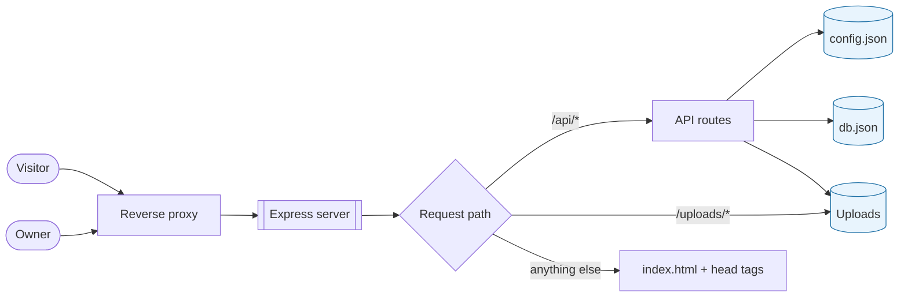

# Introduction

whoami is a self-hosted personal site you configure rather than fork and edit. This manual covers
everything after cloning: getting it running, filling it with your own content, changing the
colours, joining the webring, and putting it on a server.

## What it is

A Vue 3 single-page app and an Express API, shipped together. Nothing about the site's identity
lives in the source: every name, link, heading and piece of copy comes from a configuration file
that the admin dashboard edits. A fresh clone renders an empty site, not somebody else's.

Storage is two JSON files and a directory of uploads. There is no database to install, no migration
to run, and a backup is a tarball.

## Who uses it

| Role | How they arrive | What they can do |
| --- | --- | --- |
| **Visitor** | Any public page | Read everything, sign the guestbook, vote on posts |
| **Owner** | `/admin`, with the admin signature | Everything a visitor can, plus edit any content in place and reach the dashboard |

There is one owner and no user accounts. Authentication is a single secret — the *admin signature* —
exchanged for a bearer token that expires after twelve hours.

## How the pieces fit

In production a single Node process answers for all of it, so the site and its API share one origin.
That is what lets the server inject the document head — title, description, Open Graph tags and
`rel="me"` links — into the HTML before it goes out, which is the only way crawlers and link
previews ever see them.

## Two rules worth knowing up front

**Environment seeds, the dashboard owns.** Environment variables fill empty configuration fields on
the first boot and are ignored from then on. A stale `.env` on an old server can never revert
something you edited months later.

**The backend is the security boundary.** The in-place edit buttons and the dashboard route guard
are convenience. Every write is re-checked against the bearer token on the server, whatever the
interface offered.

## See also

- [First run](02_getting_started/01_first_run.md)
- [How configuration works](02_getting_started/02_configuration_model.md)
