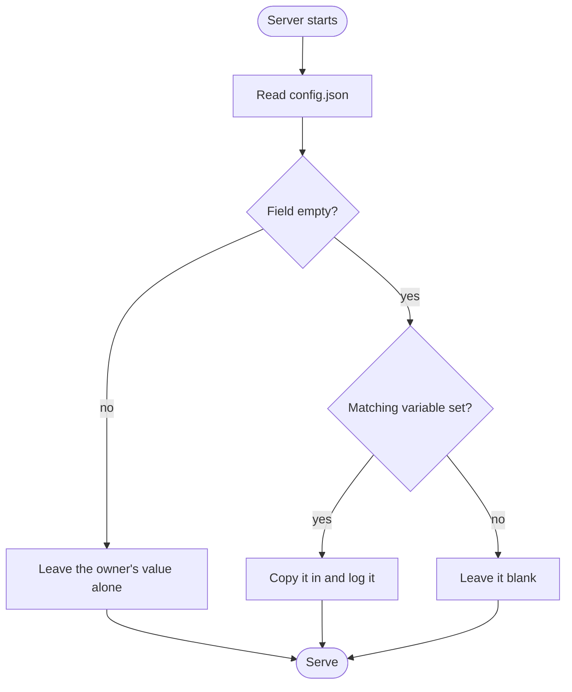

# How Configuration Works

There are two layers, and only one of them is in charge.

## Environment seeds, the dashboard owns

**Environment variables seed the first boot.** On startup the server looks at each field in
`backend/config.json`. If a field is still empty and a matching variable is set, it copies the value
in and logs what it did. If the field already holds something, it leaves it alone.

**The dashboard owns everything afterwards.** Once a value exists in `config.json`, no environment
variable can overwrite it. Editing `.env` after the first boot changes nothing.

This split exists so that a deploy is reproducible without being rigid. You can bring a server up
from a script with no manual steps, and you can then change your job title from your phone without
redeploying anything. It also means a stale `.env` sitting on an old server can never quietly revert
edits you made months ago.

## Development is permissive, production is strict

In development nothing is mandatory. `yarn server` works on a fresh clone with an empty `.env`, and
missing values print warnings.

In production the server validates the environment before it binds a port, and exits with a message
naming each problem if something is wrong. It only demands a variable when the config cannot already
supply the value. So `ADMIN_SIGNATURE`, `SITE_OWNER` and `SITE_URL` are required for a brand new
deploy, and stop being required once the corresponding config fields are filled.

A value that is present but malformed — a bogus timezone, a relative site URL, a four-character
password — always fails startup, because that is a typo rather than a choice.

## Where the files live

| File | Holds |
| --- | --- |
| `backend/config.json` | Every setting, all page copy, both palettes, the hashed signature |
| `backend/db.json` | Projects, articles, blog posts, guestbook entries, lists, books |
| `backend/uploads/` | Uploaded images and PDFs |

`WHOAMI_DATA_DIR` moves all three somewhere else, which is what the container images do so that a
single volume holds every mutable file.

## See also

- [Environment variables](../05_reference/01_environment_variables.md)
- [Backups](../07_operations/01_backups.md)
