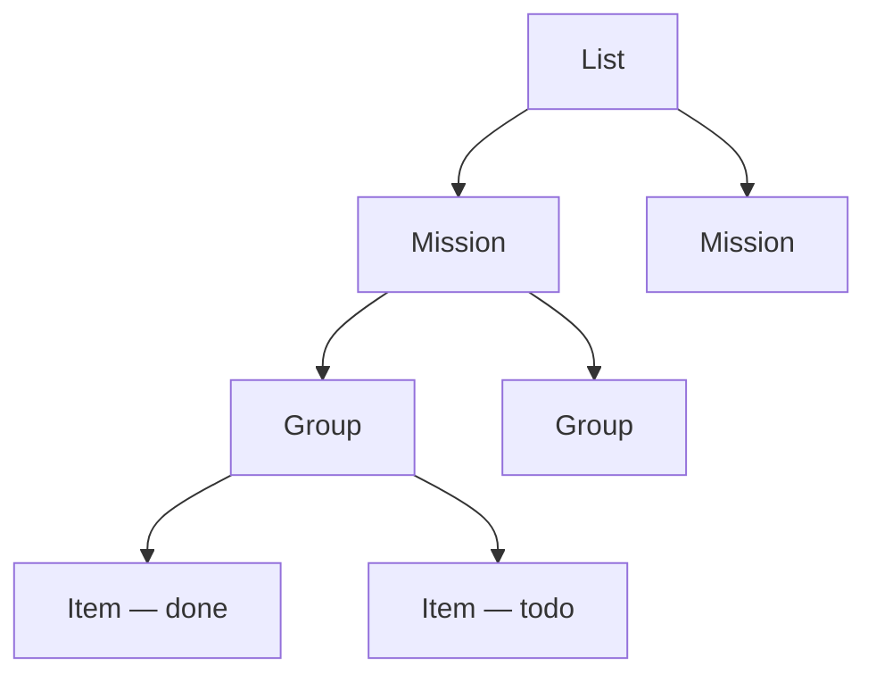

# Lists and Books

Two public collections that are neither posts nor projects: checklists you keep in the open, and a
shelf of what you are reading.

## Lists

`/lists` holds public checklists — a plan, a reading list, anything with boxes to tick. A card per
list leads with how much of it is done, which is the reason to keep one in public at all. Following
a card opens the list itself at `/lists/<slug>`.

A list has three levels: **missions** (what is being worked towards), **groups** inside them (a
phase or a category), and **items** (one checkable step). Two levels would force phases to become
either separate missions or a flat wall of items; four would be a folder tree.

Everything is edited in place while signed in — add and reorder missions, add groups, add and edit
items, and tick boxes straight on the page. When adding a group you can paste a whole checklist into
the items box, one per line; leading bullets and `[ ]` / `[x]` markers are stripped, and a ticked
marker carries through, so a list can come straight out of a notes app or a markdown file.

Ticking a box is a write and sits behind the same auth as everything else. Visitors see the state as
plain markers, not controls: the boxes record what you have actually done, so a visitor being able
to tick one would make the page a fiction.

Link a list from the More page by adding a card whose link is `/lists` — an internal path renders as
an in-app link rather than opening a new tab.

## Books

`/books` is a shelf: what you are reading, what you have read, and what is queued up. Grouped by
where a book stands rather than listed flat, because what is open right now is the part a visitor is
likely to care about.

A book is a title, an author and a **link to the book itself** — the publisher's page or the
author's own. Not a file. There is no upload here and nothing hosts a copy of anything.

Add and edit books in place while signed in. The progress field ("page 39", "half way") only shows
while the status is Reading now, so a finished book does not carry a stale page number.

No covers, on purpose: a shelf where half the books have a picture and half do not looks broken, and
the link is the useful part.

Link it from the More page with a card pointing at `/books`.

## See also

- [Managing content](01_managing_content.md)
- [Reactions, uploads and search](04_reactions_uploads_search.md)
