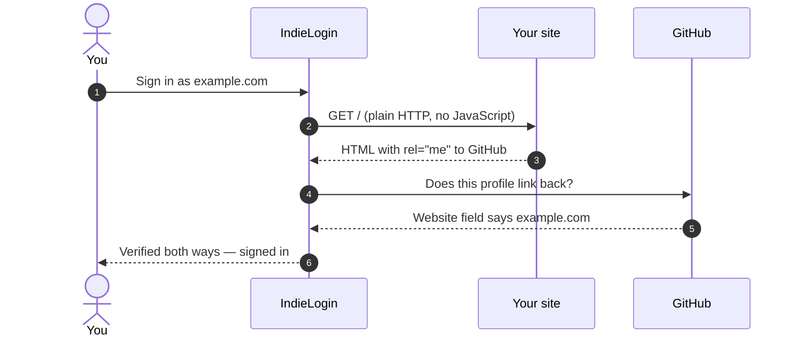

# The Webring and Web Sign-In

Two IndieWeb features: a loop of links between personal sites, and signing in to other services as
your own domain.

## The webring

A webring is a loop of sites that link to each other. Each member's footer has a previous and a next
link, so a visitor can walk from site to site around the ring. It was how people found each other
before search engines, and it works well for personal sites that no algorithm will ever surface.

The default ring is the IndieWeb webring at <https://xn--sr8hvo.ws/>.

**You have to register yourself.** Enabling the setting does not join anything. Go to the ring's
site, follow its joining instructions, and wait for your site to be accepted.

There is no slug, key or member ID to configure. The ring exposes bare `/previous` and `/next`
endpoints and works out which member sent the visitor from the HTTP referrer. That is the entire
integration.

Turn it on in the dashboard under **Site meta**, in the Webring section, or seed it on first boot
with `WEBRING_ENABLED=1`. The section also lets you change the ring name and base URL if you joined
a different ring. Once it is on, the footer shows:

```
← IndieWeb Webring →
```

The links are hidden whenever the ring is off or the base URL is empty, so a half-configured ring
never renders a dead arrow.

## Signing in as your domain

Some sites let you log in with your own domain instead of a username — Web Sign-In, usually via
[IndieLogin.com](https://indielogin.com/). Nothing needs enabling here: the server puts a
`<link rel="me">` in the head of every page for each contact channel you have configured and not
hidden.

That it is **server rendered** is the whole point. This is a single-page app, and IndieLogin fetches
your URL with a plain HTTP client — it never runs the JavaScript that would draw the contact links,
so a `rel="me"` that only exists in a Vue component is invisible to it.



## Verification is reciprocal

The second half is not something this project can do for you:

| Profile | What you have to do |
| --- | --- |
| GitHub | Put your site URL in the **Website** field of your GitHub profile |
| GitLab, Codeberg | The same, in their profile website field |
| Email | Nothing — the provider mails you a one-time code |
| Mastodon | Add your site URL as a profile metadata field |

X and LinkedIn strip `rel="me"` from outbound links, so they can never verify. They are still worth
claiming — the link says the accounts are yours — they just are not sign-in options.

Check both directions against the deployed site:

```bash
./scripts/check-identity.sh https://your-domain.example
```

It reads the HTML a plain client sees, lists every `rel="me"` it finds, follows each one, and tells
you which link back. It exits non-zero when nothing is verified both ways.

## Restricting to stronger providers

If you would rather only allow the stronger providers, add `authn` to the rel list of the ones you
want (`rel="me authn"`). IndieLogin then ignores every plain `rel="me"` link — so, for example,
GitHub with two-factor authentication becomes the only way in and the email code is no longer
offered.

That is a code change in `backend/src/server/frontend.ts`, not a setting.

## See also

- [Deploying to a single server](../06_deployment/01_single_server.md)
- [Theming](05_theming.md)
